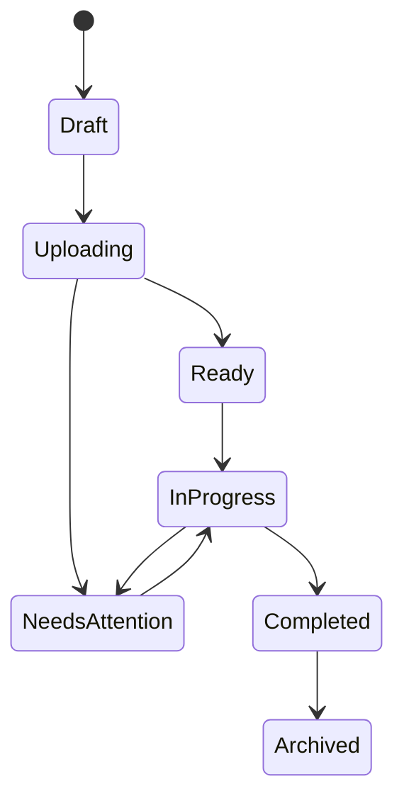
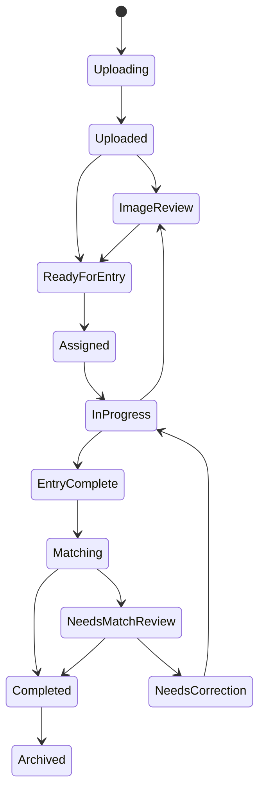

# People Intake — State Machines (Conceptual)

**Status:** draft_complete  
**Version:** 1.0  
**Build:** PEOPLE-WORKFLOW-UX-DESIGN-1.0  
**Note:** Conceptual states for UX/workflow. Exact machine contracts and enums are finalized in later engineering design.

---

## Batch States

```text
Draft
→ Uploading
→ Ready
→ In Progress
→ Needs Attention
→ Completed
→ Archived
```

### Meanings

| State | Meaning |
| --- | --- |
| Draft | Batch created; pages not fully uploaded |
| Uploading | Upload in progress |
| Ready | Uploaded and available for office work |
| In Progress | Entry and/or matching underway |
| Needs Attention | Failures, exceptions, or unresolved blockers |
| Completed | All pages resolved |
| Archived | Closed for routine work |

### Batch completion requires

- Every page resolved
- Every valid entry linked or created
- No pages in correction
- No unresolved matching conflicts
- No remaining upload failures

---

## Page States

```text
Uploading
→ Uploaded
→ Image Review
→ Ready for Entry
→ Assigned
→ In Progress
→ Entry Complete
→ Matching
→ Needs Match Review
→ Needs Correction
→ Completed
→ Archived
```

(Also: upload failure / unreadable / exception branches return through Image Review, Needs Correction, or admin resolution.)

### User-facing labels

| Conceptual state | User label |
| --- | --- |
| Uploaded | Ready for Image Review |
| Ready for Entry | Ready for Entry |
| Assigned | Assigned |
| In Progress | In Progress |
| Entry Complete | Entry Complete |
| Matching | Matching |
| Needs Match Review | Needs Match Review |
| Needs Correction | Needs Correction |
| Completed | Completed |

Do not expose internal enum-style labels to routine users.

### Transition intent (summary)

| From | To | Who / what |
| --- | --- | --- |
| Uploading | Uploaded | Successful page upload |
| Uploaded | Image Review / Ready for Entry | Quality pass or skip review |
| Ready for Entry | Assigned | Claim Next Page |
| Assigned | In Progress | First draft activity |
| In Progress | Entry Complete | Submit page |
| Entry Complete | Matching | System starts evaluation |
| Matching | Needs Match Review | Possible/conflict outcomes remain |
| Matching / Needs Match Review | Completed | All entries resolved |
| Any entry phase | Needs Correction | Reviewer/admin return |
| Needs Correction | In Progress / Entry Complete | Operator resubmits |
| Entry | Image Review exception | Bad image send-back |
| Completed | Archived | Admin archive |

---

## Intake Entry States

```text
Draft
→ Transcribed
→ Matching
→ Exact Match
→ Possible Match
→ No Match
→ Conflict
→ Linked Existing or Created New
→ Completed
```

Correction branch: any post-transcribe state may return to Needs Correction / Draft-like edit, then resume Matching.

### Outcome notes

- Exact Match auto-link policy deferred
- No Match auto-create policy deferred
- Possible Match and Conflict always require human review in Version 1 intent

---

## Claim States (Page overlay)

```text
Unclaimed
→ Claimed
→ Active (renewed)
→ Expiring Soon (warning)
→ Expired
→ Released / Reassigned
```

Expired does not delete drafts.

---

## Save / Sync Status (UI overlay, not domain state)

```text
Saving
Saved
Offline
Save failed — retrying
Upload Failed
Needs Attention
```

---

## Diagrams (Mermaid)




