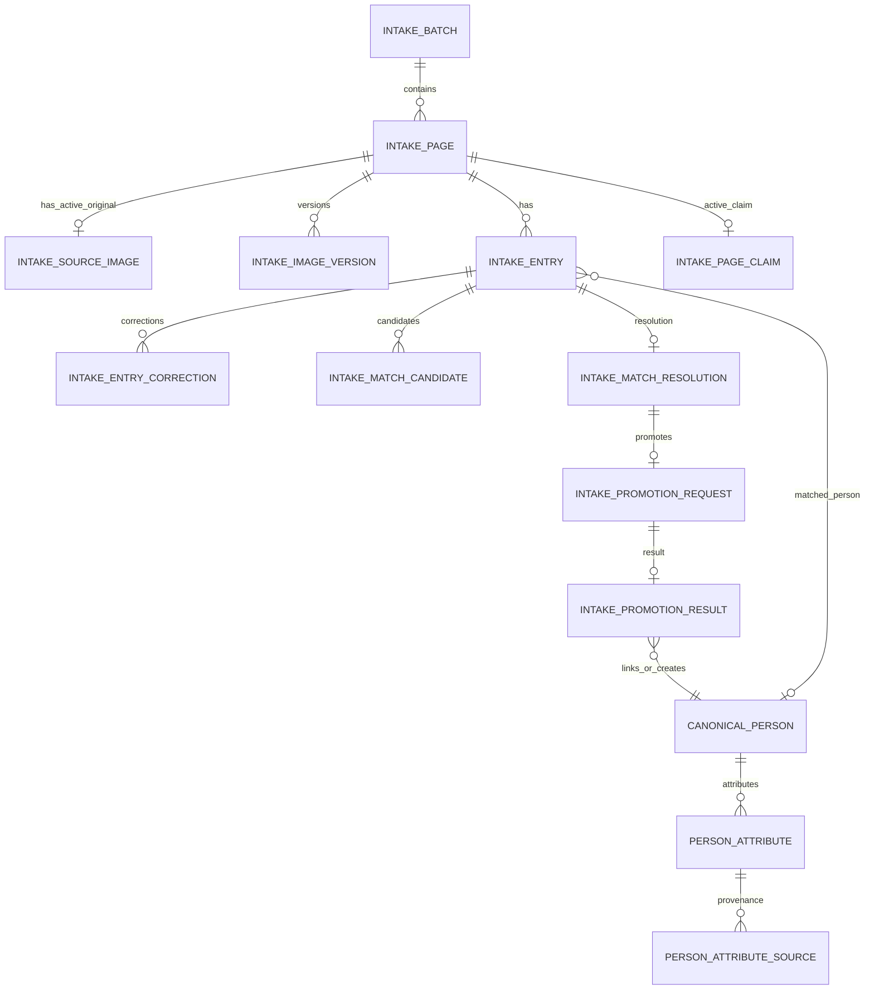
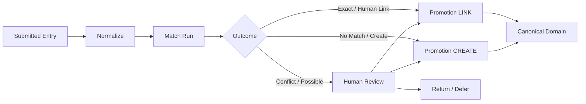

# People Intake — Entity Relationship Diagram (Conceptual)

**Status:** draft_complete  
**Version:** 1.0  
**Build:** PEOPLE-DATA-MATCHING-STORAGE-DESIGN-1.0  
**Note:** Conceptual ERD. Final table/column names require shared-database audit.

---

## Hierarchy Diagram



---

## Relationship Rules

| From | To | Cardinality | Notes |
| --- | --- | --- | --- |
| Batch | Page | 1:N | Page number unique in batch |
| Page | Entry | 1:0–10 | Blank rows create no entry |
| Page | Active original image | 1:0–1 | Replacement creates new version |
| Entry | Match candidates | 1:N | Ranked |
| Entry | Final resolution | 1:0–1 | One final resolution |
| Resolution | Promotion request | 1:0–1 | Per resolution version |
| Entry | Canonical person | N:0–1 | After successful promotion/link |
| Person | Attributes | 1:N | Multiple emails/phones allowed |
| Attribute | Provenance | 1:N | Mandatory for intake-originated |

---

## Boundary Crossing

People Intake never imports RedDirt code. Crossing into canonical domain occurs only through controlled promotion contracts.

```text
Intake Entry → Match Resolution → Promotion Request → Canonical Person Service → Person + Attributes + Provenance
```

---

## Diagram: Promotion Flow


